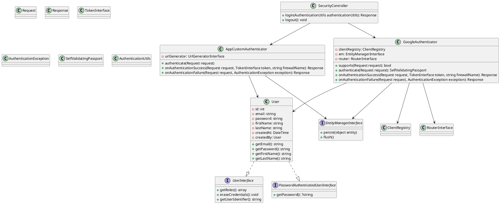
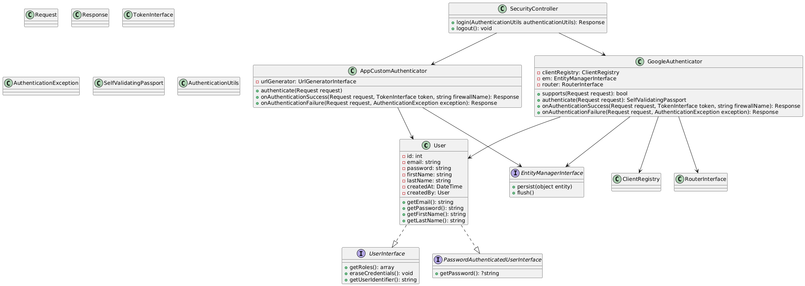

# Register

```plantuml
@startuml
class User {
    - id: int
    - email: string
    - password: string
    - firstName: string
    - lastName: string
    - createdAt: DateTime
    - createdBy: User
    + getEmail(): string
    + getPassword(): string
    + getFirstName(): string
    + getLastName(): string
}

interface UserInterface {
    + getRoles(): array
    + eraseCredentials(): void
    + getUserIdentifier(): string
}

interface PasswordAuthenticatedUserInterface {
    + getPassword(): ?string
}

User ..|> UserInterface
User ..|> PasswordAuthenticatedUserInterface

class AppCustomAuthenticator {
    - urlGenerator: UrlGeneratorInterface
    + authenticate(Request request)
    + onAuthenticationSuccess(Request request, TokenInterface token, string firewallName): Response
    + onAuthenticationFailure(Request request, AuthenticationException exception): Response
}

class GoogleAuthenticator {
    - clientRegistry: ClientRegistry
    - em: EntityManagerInterface
    - router: RouterInterface
    + supports(Request request): bool
    + authenticate(Request request): SelfValidatingPassport
    + onAuthenticationSuccess(Request request, TokenInterface token, string firewallName): Response
    + onAuthenticationFailure(Request request, AuthenticationException exception): Response
}

class SecurityController {
    + login(AuthenticationUtils authenticationUtils): Response
    + logout(): void
}

interface EntityManagerInterface {
    + persist(object entity)
    + flush()
}

class Request
class Response
class TokenInterface
class AuthenticationException
class ClientRegistry
class SelfValidatingPassport
class RouterInterface
class AuthenticationUtils

' Relations pour l'authentification
AppCustomAuthenticator --> EntityManagerInterface
AppCustomAuthenticator --> User
GoogleAuthenticator --> ClientRegistry
GoogleAuthenticator --> EntityManagerInterface
GoogleAuthenticator --> RouterInterface
GoogleAuthenticator --> User

SecurityController --> AppCustomAuthenticator
SecurityController --> GoogleAuthenticator
@enduml
```

