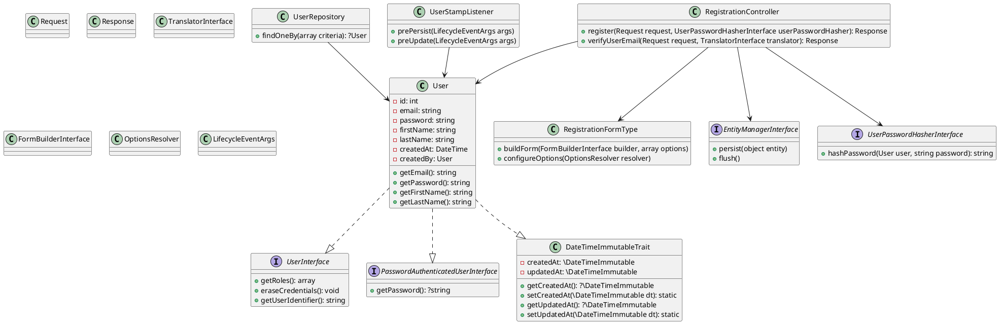
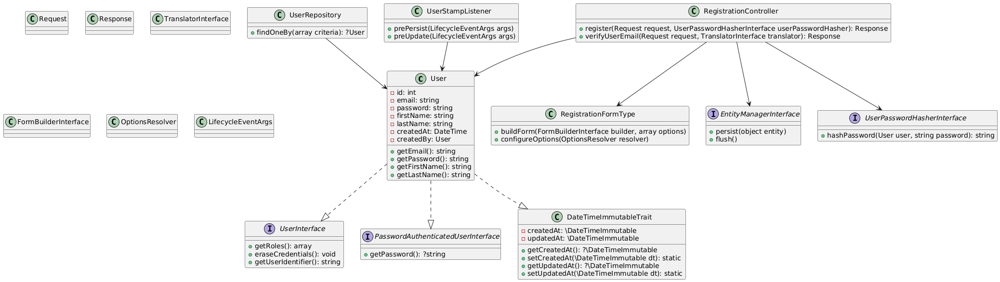

# Register

```plantuml
@startuml
class User {
    - id: int
    - email: string
    - password: string
    - firstName: string
    - lastName: string
    - createdAt: DateTime
    - createdBy: User
    + getEmail(): string
    + getPassword(): string
    + getFirstName(): string
    + getLastName(): string
}

interface UserInterface {
    + getRoles(): array
    + eraseCredentials(): void
    + getUserIdentifier(): string
}

interface PasswordAuthenticatedUserInterface {
    + getPassword(): ?string
}

class DateTimeImmutableTrait {
    - createdAt: \DateTimeImmutable
    - updatedAt: \DateTimeImmutable
    + getCreatedAt(): ?\DateTimeImmutable
    + setCreatedAt(\DateTimeImmutable dt): static
    + getUpdatedAt(): ?\DateTimeImmutable
    + setUpdatedAt(\DateTimeImmutable dt): static
}

User ..|> DateTimeImmutableTrait
User ..|> UserInterface
User ..|> PasswordAuthenticatedUserInterface

class RegistrationFormType {
    + buildForm(FormBuilderInterface builder, array options)
    + configureOptions(OptionsResolver resolver)
}

class RegistrationController {
    + register(Request request, UserPasswordHasherInterface userPasswordHasher): Response
    + verifyUserEmail(Request request, TranslatorInterface translator): Response
}

class UserRepository {
    + findOneBy(array criteria): ?User
}

class UserStampListener {
    + prePersist(LifecycleEventArgs args)
    + preUpdate(LifecycleEventArgs args)
}

interface EntityManagerInterface {
    + persist(object entity)
    + flush()
}

interface UserPasswordHasherInterface {
    + hashPassword(User user, string password): string
}

class Request
class Response
class TranslatorInterface
class FormBuilderInterface
class OptionsResolver
class LifecycleEventArgs

' Relations pour l'enregistrement
UserRepository --> User
UserStampListener --> User

RegistrationController --> RegistrationFormType
RegistrationController --> EntityManagerInterface
RegistrationController --> UserPasswordHasherInterface
RegistrationController --> User
@enduml
```

